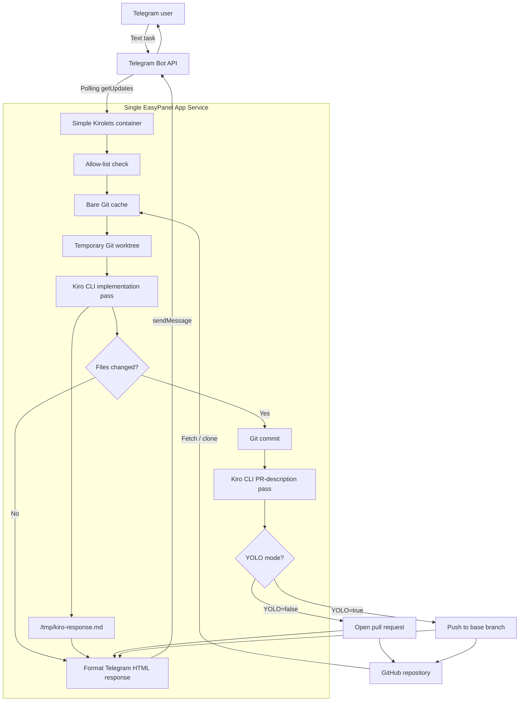

# Simple Kirolets


Simple Kirolets lets you control Kiro from Telegram.

Send a text message to your Telegram bot, and Simple Kirolets runs Kiro CLI headlessly
against a configured GitHub repository. When Kiro is done, the bot reports Kiro's response
back to Telegram and either opens a pull request or pushes directly to the base branch when
`YOLO=true`.

This project is intentionally small: one Docker image, one EasyPanel App Service, no Redis,
no worker service, no webhooks, and no voice transcription. It is built for courses,
workshops, and first deployments where the core productivity loop matters more than
production topology.

## Architecture

Simple Kirolets runs as one process in one container. The bot polls Telegram, performs the
Kiro/Git workflow synchronously, then replies to the same chat.



## Features

- Telegram polling, so no public webhook URL is required.
- Text-only requests for a simpler first learning path.
- Headless Kiro CLI execution.
- Bare Git cache to avoid recloning the target repo for every request.
- Temporary per-request Git worktrees.
- GitHub PR creation through the GitHub REST API.
- Kiro-generated PR title and description.
- Optional `YOLO=true` direct-push mode.
- Single-service Docker/EasyPanel deployment.

## Requirements

- uv
- Python 3.14
- A Telegram bot token from BotFather
- A GitHub token for the repository Kiro will edit
- A Kiro API key

## Local Setup

```powershell
uv python install 3.14
uv sync --dev
Copy-Item .env.example .env
```

Edit `.env` and set the required values.

## Run Locally

```powershell
uv run simple-kirolets
```

Then send a text message to your Telegram bot.

## Test

```powershell
uv run pytest
uv run ruff check .
python -m compileall src tests
```

## Environment Variables

```env
TELEGRAM_BOT_TOKEN=
TELEGRAM_ALLOWED_USER_IDS=
LOG_LEVEL=INFO

GITHUB_REPOSITORY_URL=
GITHUB_TOKEN=
GITHUB_USERNAME=
GITHUB_EMAIL=
GITHUB_BASE_BRANCH=main
GIT_CACHE_DIR=.simple-kirolets/git-cache

KIRO_API_KEY=
KIRO_TRUST_TOOLS=read,grep,write,bash
KIRO_TIMEOUT_SECONDS=1800

PROGRESS_UPDATE_INTERVAL_SECONDS=30
YOLO=false
```

`GITHUB_TOKEN` needs enough permission to clone/fetch repository contents, push branches,
and create pull requests. For fine-grained GitHub tokens, start with:

- Contents: read/write
- Pull requests: read/write
- Metadata: read

If `YOLO=true`, the token also needs permission to push directly to `GITHUB_BASE_BRANCH`,
and branch protection may still block the push.

`GITHUB_USERNAME` and `GITHUB_EMAIL` are used as the Git commit identity inside temporary
worktrees. Set them to a real GitHub username and email, or a GitHub no-reply email, so
`git commit` works inside containers.

Set `TELEGRAM_ALLOWED_USER_IDS` to a comma-separated list of numeric Telegram user IDs to
restrict who can use the bot. Leave it empty to allow any Telegram user who can message the
bot.

## EasyPanel Deployment

See the full [EasyPanel deployment guide](docs/easypanel-deployment.md).

## Persistent Git Cache

Simple Kirolets stores a bare Git cache at `GIT_CACHE_DIR`. For EasyPanel, mount a volume
if you want that cache to survive redeploys:

```text
Mount path: /app/.simple-kirolets
```

Then set:

```env
GIT_CACHE_DIR=/app/.simple-kirolets/git-cache
```

Without a persistent volume, the app still works; it just rebuilds the Git cache when the
container is replaced.

## YOLO Mode

Default mode:

```env
YOLO=false
```

Simple Kirolets pushes a request branch and opens a GitHub PR.

YOLO mode:

```env
YOLO=true
```

Simple Kirolets commits Kiro's changes and pushes directly to `GITHUB_BASE_BRANCH`.

Use YOLO mode only in repositories where direct bot commits are acceptable.

## Teaching Path

This project is the first rung:

```text
Telegram message -> Kiro CLI -> Git branch/PR -> Telegram reply
```

Once learners understand this loop, the production Kirolets architecture can add Redis,
separate bot and worker services, voice-note transcription, and webhooks.
