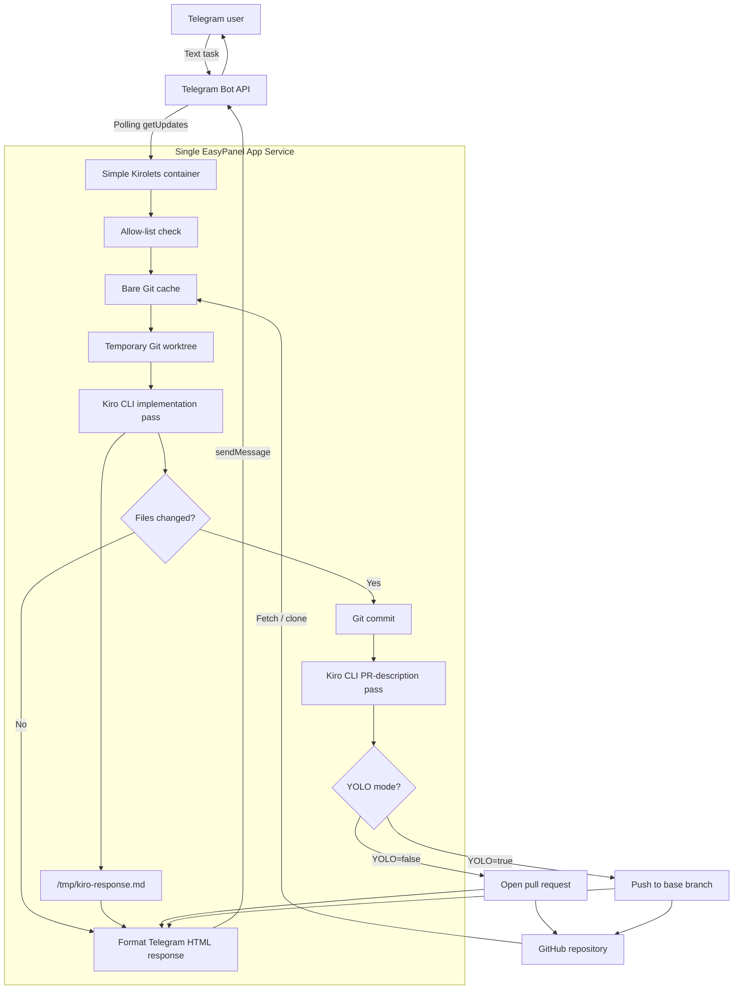

# Simple Kirolets


Simple Kirolets lets you control Kiro from Telegram.

Send a text message to your Telegram bot, and Simple Kirolets runs Kiro CLI headlessly
against a configured GitHub repository. When Kiro is done, the bot reports Kiro's response
back to Telegram and either opens a pull request or pushes directly to the base branch when
`YOLO=true`.

This project is intentionally small: one Docker image, one EasyPanel App Service, no Redis,
no worker service, no webhooks, and no voice transcription. It is built for courses,
workshops, and first deployments where the core productivity loop matters more than
production topology.

## Architecture

Simple Kirolets runs as one process in one container. The bot polls Telegram, performs the
Kiro/Git workflow synchronously, then replies to the same chat.



## Features

- Telegram polling, so no public webhook URL is required.
- Text-only requests for a simpler first learning path.
- Headless Kiro CLI execution.
- Bare Git cache to avoid recloning the target repo for every request.
- Temporary per-request Git worktrees.
- GitHub PR creation through the GitHub REST API.
- Kiro-generated PR title and description.
- Optional `YOLO=true` direct-push mode.
- Single-service Docker/EasyPanel deployment.

## Requirements

- uv
- Python 3.14
- A Telegram bot token from BotFather
- A GitHub token for the repository Kiro will edit
- A Kiro API key

## Local Setup

```bash
uv python install 3.14
uv sync --dev
cp .env.example .env
```

Edit `.env` and set the required values.

## Run Locally

```bash
uv run simple-kirolets
```

Then send a text message to your Telegram bot.

## Run With Docker

Build the image:

```bash
docker build -t simple-kirolets:local .
```

Start the bot with your local `.env` file and a persistent Git cache volume:

```bash
mkdir -p .simple-kirolets
docker run -d --rm \
  --env-file .env \
  -v "$(pwd)/.simple-kirolets:/app/.simple-kirolets" \
  --name simple-kirolets-local \
  simple-kirolets:local
```

Follow logs:

```bash
docker logs --tail 100 -f simple-kirolets-local
```

Stop the bot:

```bash
docker stop simple-kirolets-local
```

Only run one container or local process for a Telegram bot token at a time. Telegram polling
allows one active `getUpdates` consumer per bot.

## Test

```bash
uv run pytest
uv run ruff check .
python -m compileall src tests
```

## Environment Variables

```env
TELEGRAM_BOT_TOKEN=
TELEGRAM_ALLOWED_USER_IDS=
LOG_LEVEL=INFO

GITHUB_REPOSITORY_URL=
GITHUB_TOKEN=
GITHUB_USERNAME=
GITHUB_EMAIL=
GITHUB_BASE_BRANCH=main
GIT_CACHE_DIR=.simple-kirolets/git-cache

KIRO_API_KEY=
KIRO_TRUST_TOOLS=read,grep,write,bash
KIRO_TIMEOUT_SECONDS=1800

PROGRESS_UPDATE_INTERVAL_SECONDS=30
YOLO=false
```

`GITHUB_TOKEN` needs enough permission to clone/fetch repository contents, push branches,
and create pull requests. For fine-grained GitHub tokens, start with:

- Contents: read/write
- Pull requests: read/write
- Metadata: read

If `YOLO=true`, the token also needs permission to push directly to `GITHUB_BASE_BRANCH`,
and branch protection may still block the push.

`GITHUB_USERNAME` and `GITHUB_EMAIL` are used as the Git commit identity inside temporary
worktrees. Set them to a real GitHub username and email, or a GitHub no-reply email, so
`git commit` works inside containers.

Set `TELEGRAM_ALLOWED_USER_IDS` to a comma-separated list of numeric Telegram user IDs to
restrict who can use the bot. Leave it empty to allow any Telegram user who can message the
bot.

## FAQ: Getting Tokens And IDs

### How do I get a Kiro API key?

Simple Kirolets runs Kiro CLI in headless mode, so it needs `KIRO_API_KEY`.

1. Sign in to [app.kiro.dev](https://app.kiro.dev).
2. Use a Kiro Pro, Pro+, Pro Max, or Power account. API key authentication is only available
   on those plans.
3. Open the API Keys section.
4. Create a new API key.
5. Copy it immediately. The full key is shown only when it is created.
6. Put it in `.env`:

```env
KIRO_API_KEY=ksk_xxxxxxxx
```

Kiro API keys are long-lived credentials. Store them like passwords, rotate them regularly,
and revoke them if they are ever exposed.

### How do I get a GitHub personal access token?

Simple Kirolets uses `GITHUB_TOKEN` to clone the target repository, push request branches,
and open pull requests.

Prefer a fine-grained personal access token:

1. Open GitHub.
2. Go to Settings.
3. Go to Developer settings.
4. Open Personal access tokens.
5. Choose Fine-grained tokens.
6. Generate a new token.
7. Select the owner and only the repository Kiro should edit.
8. Grant these repository permissions:
   - Metadata: read
   - Contents: read/write
   - Pull requests: read/write
9. Set an expiration.
10. Copy the token into `.env`:

```env
GITHUB_TOKEN=github_pat_xxxxxxxx
```

If `YOLO=true`, the token also needs permission to push directly to `GITHUB_BASE_BRANCH`,
and branch protection may still reject the push.

### How do I get a Telegram bot token?

`TELEGRAM_BOT_TOKEN` belongs to the bot, not to your personal Telegram account.

1. Open Telegram.
2. Start a chat with [@BotFather](https://t.me/BotFather).
3. Send `/newbot`.
4. Follow the prompts to choose a bot name and username.
5. BotFather gives you a token.
6. Put it in `.env`:

```env
TELEGRAM_BOT_TOKEN=1234567890:xxxxxxxxxxxxxxxxxxxxxxxxxxxxxxxxxxx
```

Treat the bot token like a password. If it leaks, revoke it in BotFather and create a new
one.

### How do I get my Telegram user ID?

`TELEGRAM_ALLOWED_USER_IDS` is not your phone number and not your `@username`. It is a
numeric Telegram account ID.

The quickest beginner-friendly option is:

1. Open Telegram.
2. Search for `@userinfobot`.
3. Start it.
4. Copy the numeric `id` it shows.
5. Put it in `.env`:

```env
TELEGRAM_ALLOWED_USER_IDS=123456789
```

You can also use your own bot:

1. Start Simple Kirolets with `TELEGRAM_ALLOWED_USER_IDS` empty.
2. Send a message to your bot.
3. Temporarily inspect the incoming Telegram update with the Bot API:

```bash
curl "https://api.telegram.org/bot<YOUR_BOT_TOKEN>/getUpdates"
```

Look for:

```json
"from": {
  "id": 123456789
}
```

Then set `TELEGRAM_ALLOWED_USER_IDS` to that number and restart the bot.

### Should I paste tokens into chat, GitHub issues, or course comments?

No. Put secrets directly in `.env` or in your deployment platform's secret/environment
variable UI.

If a token is pasted somewhere public or semi-public, rotate it immediately.

## EasyPanel Deployment

See the full [EasyPanel deployment guide](docs/easypanel-deployment.md).

## Persistent Git Cache

Simple Kirolets stores a bare Git cache at `GIT_CACHE_DIR`. For EasyPanel, mount a volume
if you want that cache to survive redeploys:

```text
Mount path: /app/.simple-kirolets
```

Then set:

```env
GIT_CACHE_DIR=/app/.simple-kirolets/git-cache
```

Without a persistent volume, the app still works; it just rebuilds the Git cache when the
container is replaced.

## YOLO Mode

Default mode:

```env
YOLO=false
```

Simple Kirolets pushes a request branch and opens a GitHub PR.

YOLO mode:

```env
YOLO=true
```

Simple Kirolets commits Kiro's changes and pushes directly to `GITHUB_BASE_BRANCH`.

Use YOLO mode only in repositories where direct bot commits are acceptable.

## Teaching Path

This project is the first rung:

```text
Telegram message -> Kiro CLI -> Git branch/PR -> Telegram reply
```

Once learners understand this loop, the production Kirolets architecture can add Redis,
separate bot and worker services, voice-note transcription, and webhooks.

## Next: Service-Oriented Kirolets

This repository is intentionally simple. The more production-oriented version lives in
[Kirolets](https://github.com/giusedroid/Kirolets).

That project is where the architecture can evolve toward a service-oriented ECS deployment:
separate bot/API/worker responsibilities, queue-backed execution, stronger tenancy controls,
voice transcription, and a clearer path toward paid production infrastructure.
